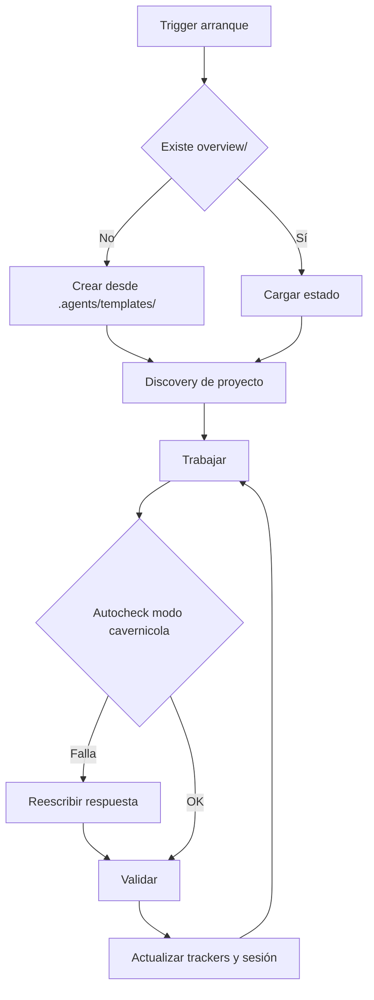

# Core Brain — go-agent-rules

## Ciclo

## Triggers de arranque

Las siguientes señales disparan el protocolo completo de bootstrap (discovery + crear `overview/` si falta + mapear archivos existentes):

- Frase **"ejecuta .agents"** → dispara el Protocolo de Auditoría de Learning.
- Inicio de sesión en cualquier proyecto con `.agents/` presente.
- Mensaje del usuario que mencione "nuevo proyecto", "inicializar", "bootstrap" o similar.
- Ausencia de `overview/session.md` al comenzar cualquier tarea de código.
- Primer mensaje de una conversación cuando el proyecto tiene `.agents/` pero no tiene `overview/`.
- **Mensaje que comienza con `$`** → reconocer como $-comando y ejecutar protocolo definido en `core/commands.md` sin bootstrap completo previo.

## Protocolo "ejecuta .agents"

Cuando el usuario escribe **"ejecuta .agents"** (o variante como "corre .agents", "bootstrap .agents"):

1. **Leer el core completo**: `path_map.md`, `communication.md`, `brain.md`, `commands.md` y `AGENTS.md`.
2. **Auditar y comparar `overview/learning.md` contra `.agents/core/` (Evaluación de 3 Vías)**:
   Por cada bullet en `## 📌 Propuestas de mejora`, evaluar si la propuesta fue:
   - ✅ **Aplicada**: Ya está implementada o integrada en la gobernanza/core actual.
   - ❌ **Rechazada**: Viola el **Filtro Agnóstico (Escudo Anti-parches)**.
   - ⚠️ **En Conflicto**: Entra en conflicto directo con una regla existente.
   - ⏳ **Pendiente**: Cumple el filtro agnóstico y no está aplicada ni en conflicto.
3. **Continuar con el flujo normal del core**: Inicio → Discovery → verificar `overview/` → trabajar.

## Inicio

- Ejecutar `git submodule status`.
- Leer core y `overview/session.md`, `overview/work.md`, `overview/work/tasks.md`, `overview/work/deuda_tecnica.md`, `overview/work/pendientes.md`, `overview/trackers/progress.md` y reportes de skills en `overview/work/skill/`.
- Si falta `overview/` o archivos base, crearlos desde `.agents/templates/`.
- Si falta `overview/architecture.md`, crearlo desde plantilla antes de trabajar.
- **Orden de prioridad de atención en `$work`**: 
  1. `overview/work/tasks.md` (tarea activa en execution)
  2. `overview/work/pendientes.md` (ítems de seguimiento identificados)
  3. `overview/work/deuda_tecnica.md` (deuda ordenada por prioridad **Alta**, **Media** y **Baja**)
- **Auditoría de líneas (discovery/`$boot`)**: listar archivos Go (`.go`) >250L; sugerir IDs `deuda` en `overview/work/deuda_tecnica.md`.
- **Registro preventivo previo a ejecución (Pre-execution Work Logging)**: Al recibir un requerimiento o bug, actualizar de forma automática y simultánea todos los archivos de control de `overview/` INMEDIATAMENTE antes de ejecutar cualquier acción.

### Discovery dinámico en proyectos Go

1. Identificar módulo Go (`go.mod`).
2. Mapear layout (`cmd/`, `internal/`, `pkg/`, `api/`).
3. Guardrail de tokens en discovery inicial: leer máx 5 archivos `.go` en el primer sweep; expandir solo cuando la tarea lo requiera.

## Protocolo de Carga de Contexto en 3 Capas

> **Regla de Ahorro de Tokens**: El agente **nunca** carga el directorio `overview/` completo de una vez. Sigue este orden estricto para minimizar consumo:

1. **Capa 1 — Índice**: Cargar solo `overview/session.md` + `overview/work.md` (índice maestro de IDs y estados). Suficiente para responder "¿en qué estamos?".
2. **Capa 2 — Categoría**: Si la tarea activa lo requiere, cargar el archivo de categoría correspondiente: `overview/work/tasks.md` (tarea activa) **o** `overview/work/deuda_tecnica.md` **o** `overview/work/pendientes.md`. No los tres a la vez.
3. **Capa 3 — Nodo Específico**: Solo si el trabajo lo exige, cargar archivos de arquitectura (`overview/architecture/`) o skill reports (`overview/work/skill/`). Cargar únicamente el subdocumento del módulo o skill relevante, no toda la carpeta.

> **Regla de Confianza en la Carga**: Si un archivo de `overview/` tiene campo `Confianza: baja` o `no_verificada`, el agente debe notificarlo antes de actuar sobre esa información y priorizar verificación.

## Cierre

- Ejecutar `go test ./...` y `golangci-lint run` (si está instalado). Si tests no existen → `no aplica`.
- Actualizar `overview/session.md`, `overview/work.md`, `overview/work/tasks.md`, `overview/work/deuda_tecnica.md`, `overview/work/pendientes.md`.
- Reportar: `Sesión cerrada con sincronización automática de rastreadores. Próximo: [nodo]. Estado: [verificado/no verificado/no aplica].`
