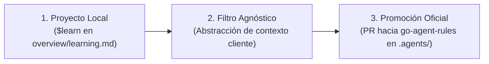

# Protocolo de Aprendizaje Continuo y Filtro Agnóstico — go-agent-rules

## Protocolo de 3 Vías

1. **Captura Local**: Durante el desarrollo, cualquier patrón Go reutilizable o lección descubierta se registra localmente en `overview/learning.md` mediante `$learn`.
2. **Filtro Agnóstico**: Se remueven rutas específicas, nombres de dominios, credenciales y cualquier código privado. La lección se convierte en un principio agnóstico de diseño Go (ej: gestión de goroutines, manejo idiomático de errores con `fmt.Errorf` y `%w`, uso de `context.Context`, etc.).
3. **Promoción Oficial**: Las lecciones validadas se promueven al repositorio central `go-agent-rules`.
