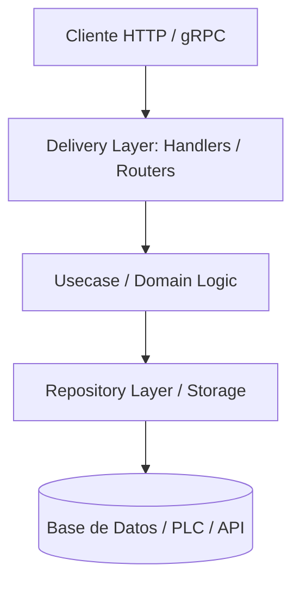

# Arquitectura Viva del Proyecto (Hub Raíz)

## Subdocumentos de Arquitectura (Spoke)
- [Mapa de Rutas](overview/architecture/routes_map.md)
- [Flujo de Datos](overview/architecture/core/data_flow.md)
- [Reglas de Importación](overview/architecture/core/import_rules.md)
